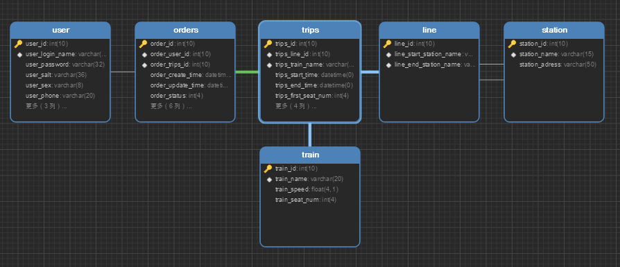
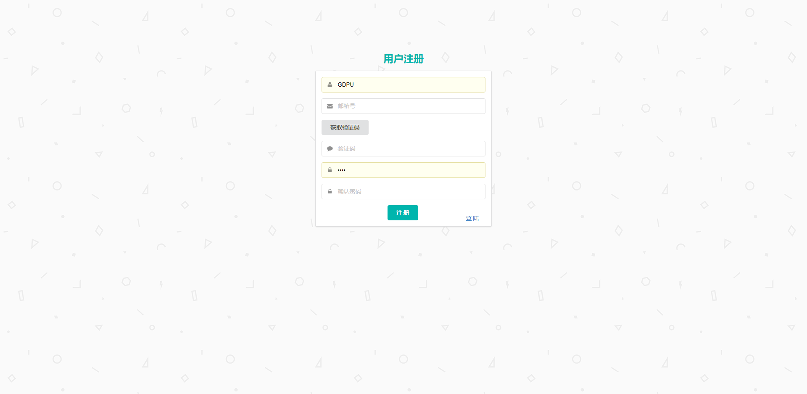
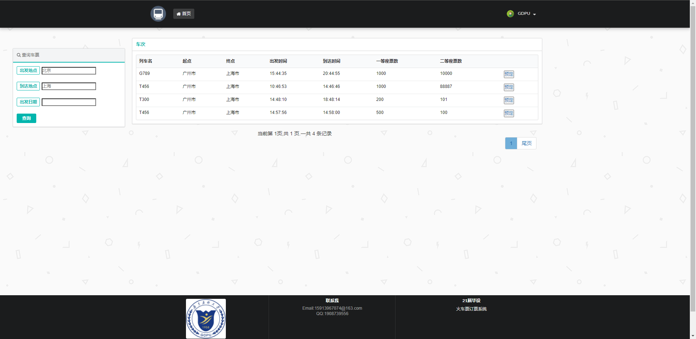
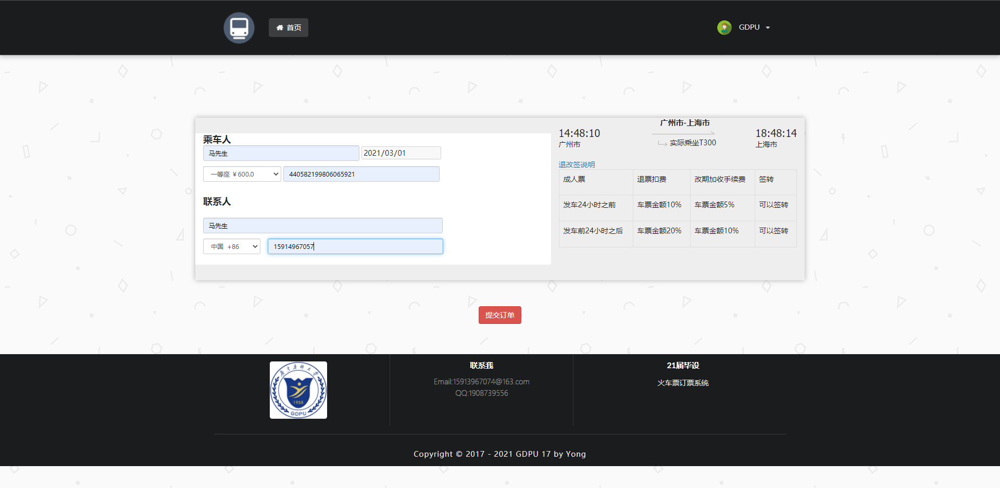
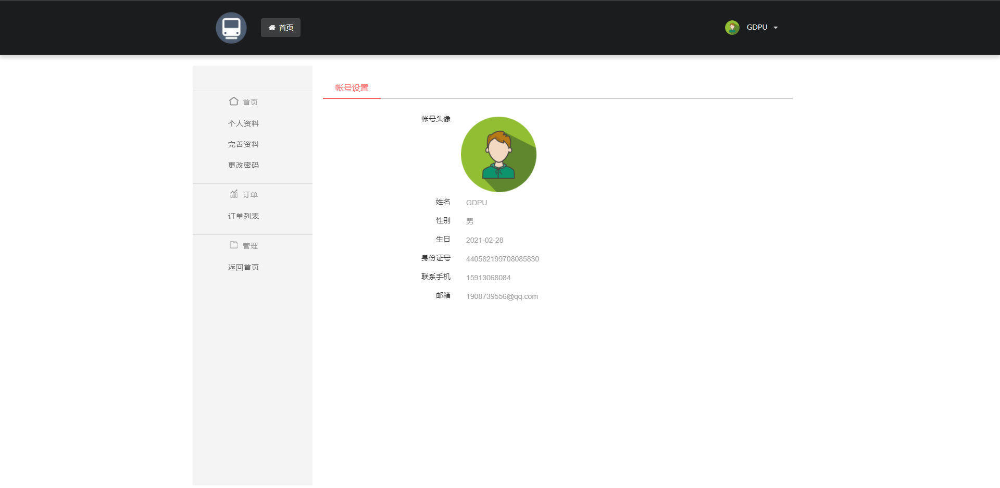
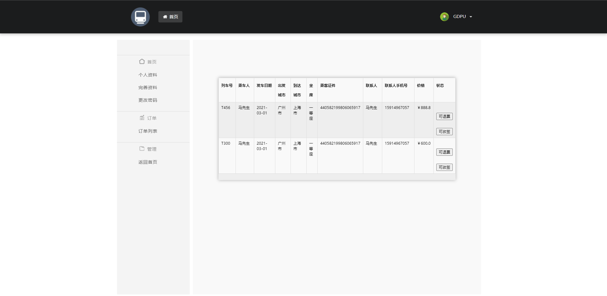
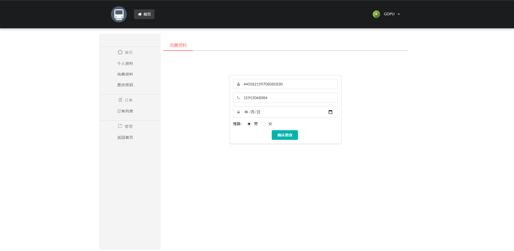
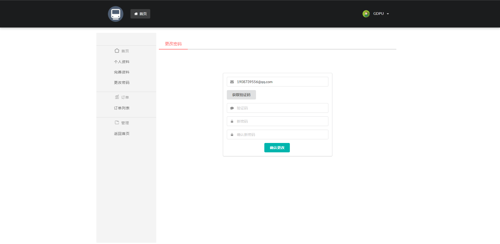

# bookticket

### 项目介绍

---------------

此项目为线上火车票订票系统，是个人大学毕设，所用知识比较基础简单，适合新手借鉴。项目基于springboot，JDK1.8.0+,Mysql 5.7，Thtmeleaf，MyBatis Plus，redis开发。它的后台管理项目在这-->https://github.com/Yong-Ma/bookticket-admin

###功能模块
-------


（1）	用户信息管理：用于用户注册或登陆以及修改个人信息。
（2）	车次查询：根据选定的条件查找符合的车次。
（3）	车票预定：购买车票并生成相关的订单信息。
（4）	车票退订：对所购买的并还未发车的车票发起退订。
（5）	订单查询：用于查看订单明细，订单信息包括车次详细信息。
（6）	车票改签：对已购买的车票进行同一线路的改签操作。
（7）	用户管理：管理员有权对一些用户的信息查阅和管理。
（8）	车次信息管理：对车次的线路、列车型号、起始时间、到达时间等信息进行管理。 
（9）	订单查询：管理员可查询用户的订单信息。
（10）线路管理：对线路的起始点、终点、距离等信息进行管理。
（11）列车信息管理：对列车的承载人员数量、最大速度等列车的有关信息进行管理。


#### 技术选型

----------

|     技术     |        说明        |                       官网                       |
| :----------: | :----------------: | :----------------------------------------------: |
|  SpringBoot  |    容器+MVC框架    |      https://spring.io/projects/spring-boot      |
| MyBatis-Plus |      ORM框架       |          https://mp.baomidou.com/guide/          |
|    Redis     |        缓存        |                https://redis.io/                 |
|    shiro     |    Java安全框架    |            https://shiro.apache.org/             |
|    Druid     |    数据库连接池    |         https://github.com/alibaba/druid         |
|    Lombok    |  简化对象封装工具  |      https://github.com/rzwitserloot/lombok      |
|  Thymeleaf   |   HTML5 模板引擎   |            https://www.thymeleaf.org/            |
|   kaptcha    |   验证码生成工具   |        https://github.com/penggle/kaptcha        |
|  pagehelper  |      分页插件      | https://github.com/pagehelper/Mybatis-PageHelper |
|    log4j     |      日志组件      |       http://logging.apache.org/log4j/2.x/       |
|   fastjson   | JSON解析器和生成器 |       https://github.com/alibaba/fastjson        |
|              |                    |                                                  |

#### 开发工具

---------------

|   工具    |            说明            |                         官网                         |
| :-------: | :------------------------: | :--------------------------------------------------: |
|   IDEA    |          开发IDE           |       https://www.jetbrains.com/idea/download        |
|  Navicat  |       数据库连接工具       |         http://www.formysql.com/xiazai.html          |
|  Typora   |       Markdown编辑器       |                  https://typora.io/                  |
| Mybatis-X | IDEA插件，用于生成部分代码 | https://baomidou.com/guide/mybatisx-idea-plugin.html |

#### 数据库
-------------



#### 环境部署

--------------

1.创建数据库book_ticket，运行`sql`文件夹下的文件

2..在application-dev.yaml里修改数据库的用户名和密码

```
    druid:
      driver-class-name: com.mysql.jdbc.Driver
      url: jdbc:mysql://localhost:3306/book_ticket?characterEncoding=utf8&useSSL=false&serverTimezone=GMT%2B8&rewriteBatchedStatements=true&allowPublicKeyRetrieval=true
      username: root
      password: admin
```

3.运行自己安装的redis

4.在application.yaml里的`mail`修改`username`和`password`,其中password不是邮箱密码，而是授权码，**获取方法**---> <u>登陆网易163邮箱，在设置中打开并勾选POP3/SMTP/IMAP服务，然后会得到一个授权码，这个邮箱和授权码将用作登陆认证。</u> 如果是使用qq邮箱还得修改`host`

```
#email
  mail:
    host: smtp.163.com
    username: ******@163.com
    password: ******
    port: 465
    protocol: smtps
    from: *****@163.com
```

5..在application.yaml里修改`logging`的file.path，自己创建一个文件夹用于存放日志文件；以及在logback-spring.xml里面修改`logging.path`的value值为自己的创建的文件夹

```
#日志配置
logging:
  level:
    #打印sql语句
    com.ma.bookticket.mapper: debug
  config: classpath:log/logback-spring.xml
  file:
    path: ******
```

```
<property name="logging.path" value="***"/>
```

6.可通过IDEA打开项目，运行springboot项目，打开网址：http://localhost:8087/

7.输入用户名GDPU,密码GDPU进行登陆

#### 项目演示

-----------
###### 登录界面


###### 注册页面



###### 车次查询



###### 订购车票



###### 个人中心



###### 查看订单



###### 完善资料



###### 更改密码



### 说明 
-------------
1. 如果使用该项目出现问题，请联系我 15913967074@163.com
2. 如果该项目对您有帮助,请`star`鼓励我

